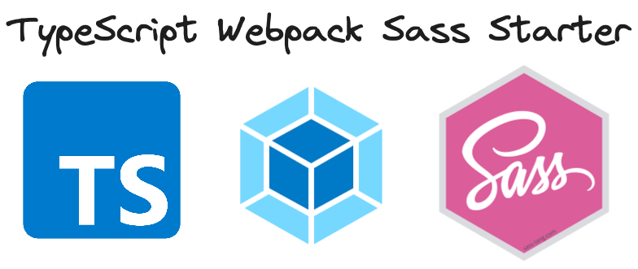

# TypeScript Webpack SCSS Starter

<div>
  
</div>

This is a starter template for a TypeScript + Webpack based frontend project that uses SCSS for styling. 

## Usage
Clone the repository in your local machine.
Run the following command to install the dependencies
```bash
npm install
# or
yarn
```

Then run the following command to start the dev server:
```bash
npm run dev
# OR
yarn dev
```

## Lint
To analyze the code statically using ESLint, use the following command:
```bash
npm run lint
# OR
yarn lint
```

## Test
To run the tests, run the following command:
```bash
npm run test
# OR
yarn test
```
If you want to watch the files while the tests run, use the following command instead:
```bash
npm run test:watch
# OR
yarn test:watch
```

## Build
To generate the production build, run the following command:
```bash
npm run build
# OR
yarn build
```

# License
[MIT](LICENSE)
